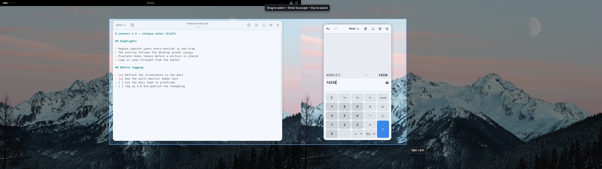
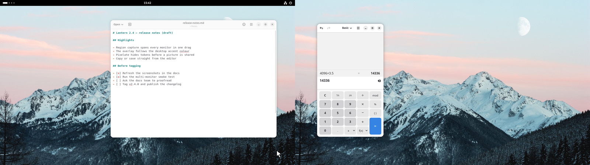
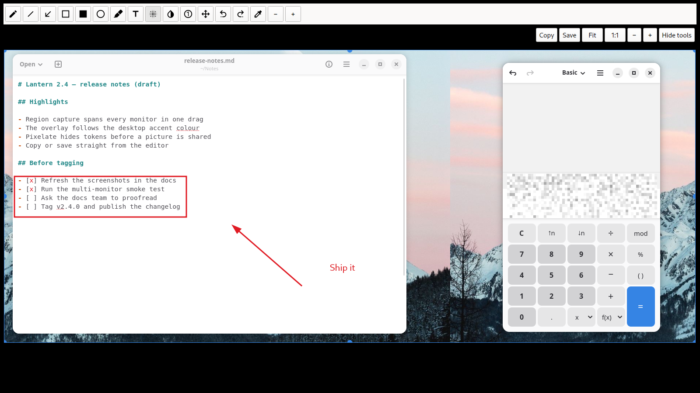

<p align="center">
  
</p>

<h1 align="center">SnipSnap</h1>

<p align="center">
  <strong>Screenshot any region of any monitor on GNOME Wayland, with no permission dialog.</strong><br>
  A Qt 6 capture-and-annotate tool whose GNOME Shell extension draws the selection inside the compositor.
</p>

<p align="center">
  <a href="https://norvitech.com"></a>
  <a href="https://github.com/spencercnorton/snipsnap/actions/workflows/ci.yml"></a>
  <a href="https://github.com/spencercnorton/snipsnap/tags"></a>
  <a href="https://apt.globalentry.systems"></a>
  <a href="LICENSE"></a>
  <a href="https://buy.stripe.com/8x26oH2U44f65TRe574wM04"></a>
</p>

<p align="center">
  <picture>
    <source media="(prefers-color-scheme: dark)" srcset="docs/screenshots/overlay-dark.png">
    
  </picture>
</p>

<p align="center"><sub>Every picture here is SnipSnap on a headless GNOME Shell 50 session with two virtual monitors, a text editor and a calculator showing invented content, and a free Pexels photograph as the wallpaper; nothing personal appears in them; they were captured with <code>scripts/demo-capture.sh</code>.</sub></p>

SnipSnap is a screenshot tool for the Linux desktop: press a key, drag a
region, annotate it, then copy or save. It is built for GNOME on Wayland,
where an application cannot read the screen and every screenshot tool
either flashes a portal permission dialog before each capture or quietly
stops working across a multi-monitor desktop. SnipSnap is a downstream fork
of [Flameshot](https://github.com/flameshot-org/flameshot) with the capture
path moved into the compositor; the editor, CLI, tray icon and configuration
file are Flameshot's, and Ubuntu 26.04 on GNOME 50 is the platform it is
built and packaged for.

## What it does

**The selection lives in the compositor.** A GNOME Shell extension draws the
dimmed screen and the selection rectangle, so one drag can start on one
monitor and end on another, mixed scales and rotations included. The
compositor already has the pixels, so there is no portal dialog and no
per-monitor boundary; the committed region is handed to the SnipSnap
daemon over a private socket and the editor opens with exactly that region.

<p align="center">
  
</p>

**A full editor, in the same process.** Arrows, rectangles, circles,
freehand pencil, marker, numbered pointers, text, secure pixelation, invert,
undo and redo, colour and size controls, zoom, pan, Fit and 1:1 — then copy
or save. The editor follows your desktop theme, light or dark, and the
overlay follows the GNOME accent colour.

<p align="center">
  <picture>
    <source media="(prefers-color-scheme: dark)" srcset="docs/screenshots/editor-dark.png">
    
  </picture>
</p>

**Nothing leaves the machine.** There is no image-host uploader and no
update checker; both are compiled out, and no code path in the shipped build
opens a network connection. Captures go to your clipboard or to the
directory you choose, and nowhere else.

**Still works where the bridge does not.** The bridge is what the
extension's shortcut drives; `snipsnap gui`, the tray icon and the D-Bus
interface take the desktop-portal path on every desktop, GNOME included. So
on X11, or on a Wayland session that is not GNOME, that is what you use: a
permission prompt and one monitor at a time, and everything else the same.
`snipsnap full` and `snipsnap screen -n 1` capture without a selection at
all.

**Optional hand-off to satty.** If you prefer [satty](https://github.com/gabm/Satty)'s
annotation window, `snipsnap-annotator enable` sends every committed capture
there instead of the built-in editor, and `disable` brings it back.

## Install

### Ubuntu 26.04 — from the APT repository

Add the repository once and SnipSnap updates with everything else:

```bash
curl -fsSL https://apt.globalentry.systems/setup.sh | sudo sh
sudo apt install snipsnap
```

`setup.sh` installs the signing key and the suite for your release; read it
first if you prefer to do those two steps by hand — it is short. Only Ubuntu
26.04 (`resolute`) on amd64 is published today. The package carries the
GNOME Shell extension and its compiled schema, so there is nothing else to
download.

Then, on GNOME Wayland, activate the bridge as your normal user:

```bash
snipsnap-shell-bridge activate
```

The first run installs and verifies the per-user bridge without taking over
<kbd>Print</kbd>. If it asks for a GNOME Shell restart, log out and back in,
then run the same command again; only after the bridge and the SnipSnap
receiver are both proven active does it hand over <kbd>Print</kbd>. Press
<kbd>Print</kbd>, drag a region, release, press <kbd>Enter</kbd>.

Installing `snipsnap` replaces the Flameshot package if it is present; the
two cannot be co-installed, because SnipSnap keeps the `flameshot` command
as a compatibility symlink. On first launch your existing Flameshot settings
are copied into `~/.config/snipsnap/` without deleting the originals.

### Other distributions — from source

Any distribution with Qt 6.2 or newer and CMake 3.22 builds SnipSnap; the
GNOME Shell bridge needs GNOME Shell 50 or 51. On Debian and Ubuntu:

```bash
sudo apt install cmake ninja-build g++ git dbus-daemon libgl-dev qt6-base-dev qt6-tools-dev qt6-tools-dev-tools qt6-svg-dev qt6-l10n-tools
git clone https://github.com/spencercnorton/snipsnap.git
cd snipsnap
cmake -S . -B build -G Ninja -DCMAKE_BUILD_TYPE=RelWithDebInfo -DBUILD_TESTING=ON \
  -DDISABLE_UPDATE_CHECKER=ON -DENABLE_IMGUR=OFF -DENABLE_GNOME_SHELL_BRIDGE=ON
cmake --build build
sudo cmake --install build
```

That installs the program and the `snipsnap-annotator` helper is
`packaging/snipsnap-annotator` in the checkout; the GNOME Shell extension is
installed per user by `python3 packaging/gnome-shell/manage_shell_bridge.py
activate` — see [the bridge guide](docs/gnome-shell-bridge.md). Without
`-DENABLE_GNOME_SHELL_BRIDGE=ON` you get a build with no compositor capture
path — the reason this program exists — and the tests still pass. To build
the same `.deb` the repository publishes, which does install the extension
system-wide: `cp -a packaging/debian debian && dpkg-buildpackage -b -us -uc`.
There is no Flatpak, Snap or AppImage.

## Documentation

- [How capture works on GNOME Wayland](docs/architecture.md) — the bridge,
  the socket protocol, the editor
- [The GNOME Shell bridge](docs/gnome-shell-bridge.md) — inspect, activate,
  roll back
- [X11 and minimal window managers](docs/UsageX11MinimalWM.md) — binding a
  global shortcut without GNOME
- [Hyprland, Sway and wlroots](docs/UsageHyprlandSwayWlroots.md) — the
  portal path on other Wayland compositors
- [CHANGELOG.md](CHANGELOG.md) — one entry per release

## Configuration

**The capture shortcut** belongs to the extension. To move it off
<kbd>Print</kbd>:

```bash
gsettings --schemadir /usr/share/gnome-shell/extensions/snipsnap-shell-bridge@kleos.norvi.tech/schemas \
  set org.gnome.shell.extensions.flameshot-shell-bridge show-capture-overlay "['<Super><Shift>s']"
gnome-extensions disable snipsnap-shell-bridge@kleos.norvi.tech
gnome-extensions enable snipsnap-shell-bridge@kleos.norvi.tech
```

The disable/enable pair matters: GNOME Shell 50 does not re-grab a
settings-backed key while the extension is running. To put SnipSnap on
<kbd>Print</kbd> yourself, first clear GNOME's own binding with
`gsettings set org.gnome.shell.keybindings show-screenshot-ui "[]"`.

**Everything else** — save directory, filename pattern, colours, which
buttons the editor shows — is in `snipsnap config`, or in the file
described below. `snipsnap config --check` validates a hand-edited file.

## Where your data lives

| Path | Purpose |
|---|---|
| `~/.config/snipsnap/snipsnap.ini` | Settings: colours, save path, filename pattern, enabled tools, the annotator choice. Read at start-up and rewritten by `snipsnap config` |
| `~/.config/autostart/SnipSnap.desktop` | Present only when "launch at start-up" is on |
| `$XDG_RUNTIME_DIR/snipsnap/gnome-shell-bridge-v1.sock` | The bridge socket, `0600`, owned by the daemon while it runs |
| `~/.cache/snipsnap/snipsnap/region.txt` | The last selection rectangle, `0600`, so `--last-region` can repeat it |
| `~/.cache/snipsnap/snipsnap/capture-trace.jsonl` | Only when `SNIPSNAP_CAPTURE_TRACE=file` is set: timing records for one capture, no pixels |
| `~/.cache/snipsnap/snipsnap/annotator.log` | Only with the external annotator on: satty's own output |
| the directory you save to | Your screenshots, and nothing else |

Nothing is sent anywhere: SnipSnap makes no network connections at all.

## Contributing and support

- Bugs and feature requests: [open an issue](https://github.com/spencercnorton/snipsnap/issues/new/choose). Questions: [Discussions](https://github.com/spencercnorton/snipsnap/discussions).
- Security reports: [private vulnerability reporting](https://github.com/spencercnorton/snipsnap/security/advisories/new) — see [SECURITY.md](SECURITY.md). There is no e-mail address; that is deliberate.
- Pull requests are welcome; read [CONTRIBUTING.md](CONTRIBUTING.md) first — this repository is a release mirror, and accepted changes ship in the next tagged release.
- If SnipSnap saves you time, you can [support its development](https://buy.stripe.com/8x26oH2U44f65TRe574wM04).

## Development

```bash
cmake -S . -B build -G Ninja -DCMAKE_BUILD_TYPE=RelWithDebInfo -DBUILD_TESTING=ON \
  -DDISABLE_UPDATE_CHECKER=ON -DENABLE_IMGUR=OFF -DENABLE_GNOME_SHELL_BRIDGE=ON -DSNIPSNAP_WARNINGS_AS_ERRORS=ON
cmake --build build
ctest --test-dir build --output-on-failure --no-tests=error   # C++ tests plus the Python checks wired into CTest
for t in tests/*_test.py; do python3 "$t" || break; done      # the Python checks, run as scripts (three need a built binary, gjs or gsettings)
(cd contrib/gnome-shell-extension && npm test)                  # node --test on the extension's own tests
clang-format --dry-run --Werror $(git ls-files 'src/*.cpp' 'src/*.h')  # lint against the .clang-format in the tree
```

The GNOME Shell end-to-end test (`tests/gnome_shell_bridge_e2e.js`) drives a
headless GNOME Shell 50 with three virtual monitors and the real daemon; it
needs the Mutter test tools and is described in
[the extension README](contrib/gnome-shell-extension/README.md#compositor-to-editor-end-to-end-test).
The README pictures come from the same rig: `scripts/demo-capture.sh`, then
`scripts/demo-assemble.py`.

## Licence

[GPL-3.0-or-later](LICENSE) © Spencer Norton

SnipSnap is derived from [Flameshot](https://github.com/flameshot-org/flameshot),
GPL-3.0-or-later, from upstream commit `bd2e6d3a0ee665470bd05f614f5087a36c076cfc`;
every upstream author and licence is recorded in [NOTICE](NOTICE) and
[packaging/debian/copyright](packaging/debian/copyright).

---

<p align="center">
  <a href="https://norvitech.com"></a>
</p>

<p align="center">
  <a href="https://github.com/spencercnorton/helios">Helios</a> ·
  <a href="https://github.com/spencercnorton/bitagent">BitAgent</a> ·
  <a href="https://github.com/spencercnorton/xnote">XNote</a> ·
  <a href="https://github.com/spencercnorton/xnote-placement">XNote Placement</a> ·
  <a href="https://github.com/spencercnorton/snipsnap">SnipSnap</a> ·
  <a href="https://norvitech.com">norvitech.com</a>
</p>
